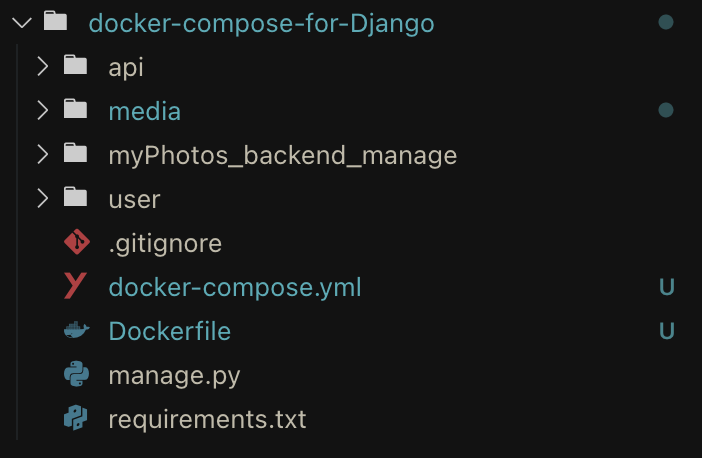
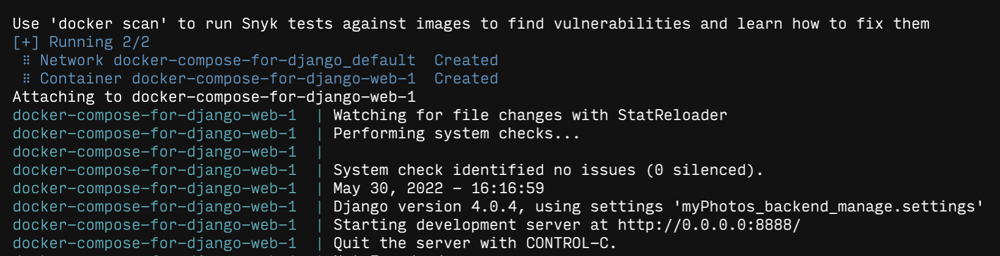

# Docker

## :octopus: docker-compose

### 部署 Django 项目

#### :herb: 项目树



#### :pencil: Dockerfile 编写

```dockerfile
# 从镜像仓库获取最新 python 镜像
FROM python:latest

# 设置环境变量
ENV PYTHONUNBUFFERED 1

# 在根目录创建工作目录
RUN mkdir /code

# 设置为工作目录
WORKDIR /code

# 从本地当前目录拷贝 requirements 文件
COPY requirements.txt /code/

# 安装 项目所需的 pip 包
RUN pip install -r requirements.txt

# 
COPY . /code/

```

#### :pencil: docker-compose 编写

```yaml
version: "3"
services:

  web:
    restart: always
    build: .
    command: python manage.py runserver 0.0.0.0:8888
    volumes:
      - .:/code
    ports:
      - "8888:8888"

```

#### :confetti_ball: 运行命令

直接运行：`docker-compose up`

参数：

* -f：指定使用 docker-compose.yml 模版文件运行
* -d：后台运行

运行成功：


