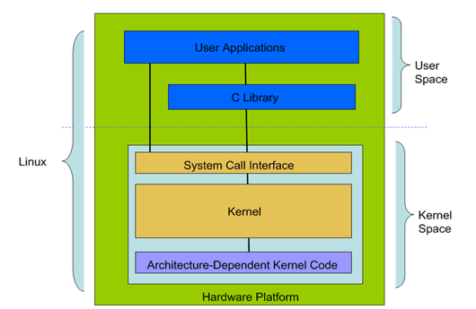

# :office_worker: 面试

## Linux

### 1. Linux 内核

Linux 系统的核心是内核。内核控制着计算机系统上所有的硬件和软件，在必要时分配硬件，并根据需要执行软件

- 系统内存管理
- 应用程序管理
- 硬件设备管理
- 文件系统管理

### 2. Linux 的基础组件

Linux 拥有：内核、shell、GUI、系统应用程序和应用程序

### 3. Linux 的体系结构

大体分为：内核空间（Kernel Space）和用户空间（User Space）

- 用户空间 (User Space) ：用户空间包括用户的应用程序(User Applications)、C 库(C Library) 。
- 内核空间 (Kernel Space) ：内核空间包括系统调用接口 (System Call Interface)、内核 (Kernel)、平台架构相关的代码 (Architecture-Dependent Kernel Code)

#### 4. Linux 进程间通信方式

- 管道（pipe）、流管道（s_pipe）、有名管道（FIFO）
- 信号（signal）
- 消息队列
- 共享内存
- 信号量
- 套接字（socket）

### 5. 什么是 inode ？

> 一般来说，面试不会问 inode 。但是 inode 是一个重要概念，是理解 Unix/Linux 文件系统和硬盘储存的基础。

理解inode，要从文件储存说起。

文件储存在硬盘上，硬盘的最小存储单位叫做"扇区"（Sector）。每个扇区储存512字节（相当于0.5KB）。

操作系统读取硬盘的时候，不会一个个扇区地读取，这样效率太低，而是一次性连续读取多个扇区，即一次性读取一个"块"（block）。这种由多个扇区组成的"块"，是文件存取的最小单位。"块"的大小，最常见的是4KB，即连续八个 sector组成一个 block。

文件数据都储存在"块"中，那么很显然，我们还必须找到一个地方储存文件的元信息，比如文件的创建者、文件的创建日期、文件的大小等等。这种储存文件元信息的区域就叫做inode，中文译名为"索引节点"。

每一个文件都有对应的inode，里面包含了与该文件有关的一些信息。

### 6. 简述 Linux 文件系统通过 i 节点把文件的逻辑结构和物理结构转换的工作过程

> 如果看的一脸懵逼，也没关系。一般来说，面试官不太会问这个题目。

Linux 通过 inode 节点表将文件的逻辑结构和物理结构进行转换。

- inode 节点是一个 64 字节长的表，表中包含了文件的相关信息，其中有文件的大小、文件所有者、文件的存取许可方式以及文件的类型等重要信息。在 inode 节点表中最重要的内容是磁盘地址表。在磁盘地址表中有 13 个块号，文件将以块号在磁盘地址表中出现的顺序依次读取相应的块。
- Linux 文件系统通过把 inode 节点和文件名进行连接，当需要读取该文件时，文件系统在当前目录表中查找该文件名对应的项，由此得到该文件相对应的 inode 节点号，通过该 inode 节点的磁盘地址表把分散存放的文件物理块连接成文件的逻辑结构。

### 7. 硬链接和软链接

#### 硬链接

**硬链接**（英语：hard link）是[计算机文件系统](https://zh.wikipedia.org/wiki/文件系统)中的多个文件平等地共享同一个文件存储单元（如[MFT条目](https://zh.wikipedia.org/wiki/NTFS)、[inode](https://zh.wikipedia.org/wiki/Inode)）。硬链接必须在同一个文件系统中；一般用户权限下的硬链接只能用于文件，不能用于目录，因为其父目录就有歧义了。删除一个文件名字后，还可以用其它名字继续访问该文件。硬链接只能用于同一个文件系统（对于NTFS是限制于同一个分区）。不能用于不存在的文件。

#### 软链接

**符号链接**（**软链接、Symbolic link**）是一类特殊的文件。一个符号链接文件仅包含有一个文本字符串，其被操作系统解释为一条指向另一个文件或者目录的路径。它是一个独立文件，其存在并不依赖于目标文件。如果删除一个符号链接，它指向的目标文件不受影响。如果目标文件被移动、重命名或者删除，任何指向它的符号链接仍然存在，但是它们将会指向一个不复存在的文件。这种情况被有时被称为*被遗弃*。

| 硬链接                                                    |                            软链接                            |
| --------------------------------------------------------- | :----------------------------------------------------------: |
| 链接文件记录了原始文件的内容                              |      链接文件只记录原始文件的路径，不记录原始文件的内容      |
| 即使原始文件被移除，链接文件也不受影响。                  | 如果原始文件被移除，软链接就会因为指向不存在的文件而失效。这被称为“挂起链接hanging link” |
| 通过 `ln <原始文件> <链接文件>` 命令创建硬链接            |      通过 `ln -s <原始文件> <链接文件>` 命令创建软链接       |
| 硬链接文件没有特殊标记                                    |           软链接文件的文件权限中有一个特殊标记 `l`           |
| 通过 `find / -samefile <原始文件>` 命令可以查找硬链接文件 |         通过 `find / -type l` 命令可以查找软链接文件         |
| 硬链接不存在失效链接                                      |       通过 `symlinks <目录>` 命令可以查找失效的软链接        |

### 8. 查找文件

#### 找出目录下大小超过 10MB 的文件

`find /usr -size +10MB`

#### 找出目录下超过 90 天未被访问过的文件

`find /var/ \! -atime -90`

#### 找出目录下 120 天之前未被修改过的文件

`find /home -mtime +120`

#### 按名字查找文件

`find / -name core`

#### 找到/tmp/目录下面的所有名称以"_s1.jpg"结尾的普通文件，如果其修改日期在一天内，则将其打包到/tmp/back.tar.gz文件中

`find /tmp -type f -name ".*_sj.jpg" -mtime 1|xarges tar zxf /tmp/back.tar.gz`

### 9. 添加路由

添加一条到 `192.168.3.0/24` 的路由，网关为 `192.168.1.254`

`route add -net 192.168.3.0/24 netmask 255.255.255.0 gw 102.168.1.254`

### 10. 登录需要加载文件

`/etc/profile` `/etc/bashrc` `~/.bashrc` `~/.bash_profile`

## shell

### 1. shell bash

