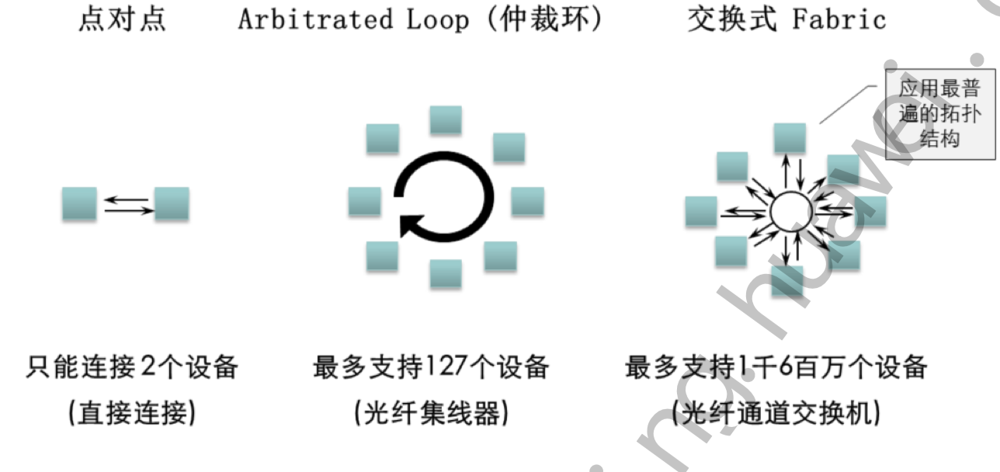
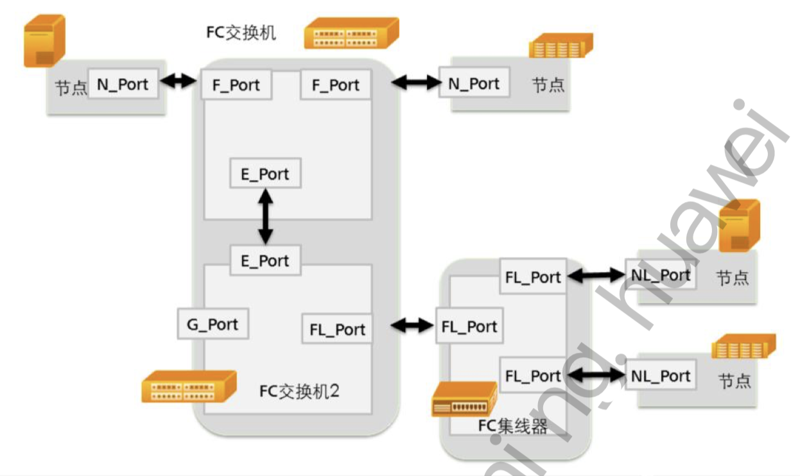
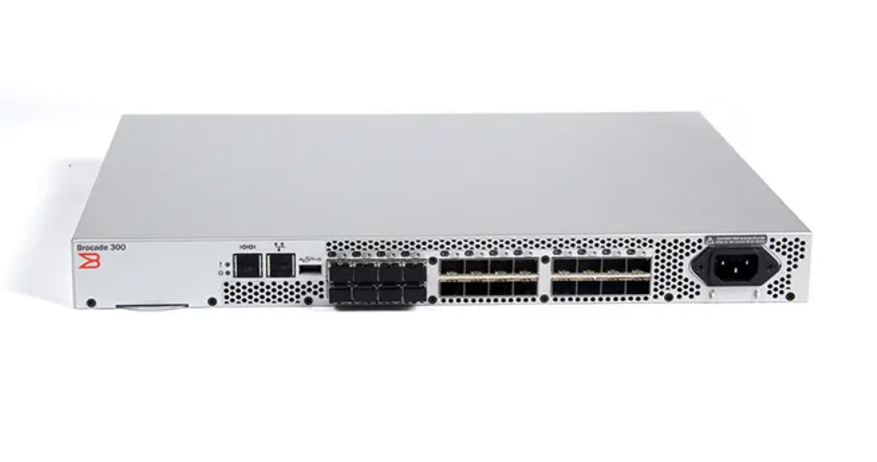
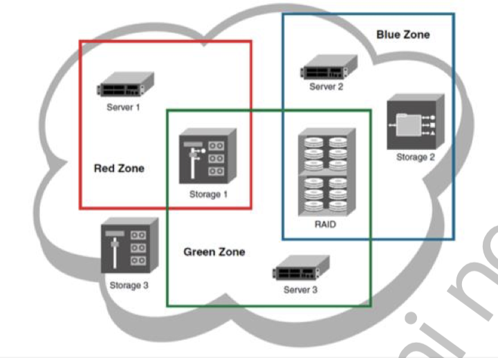
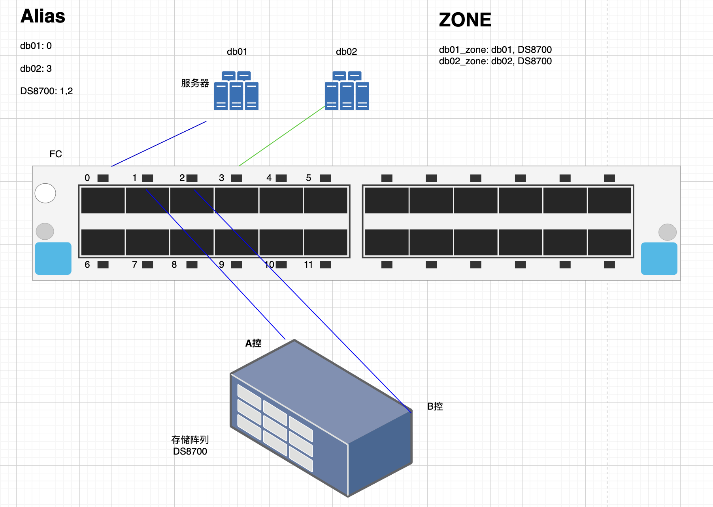
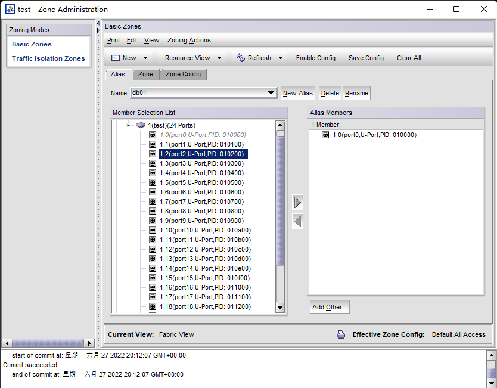
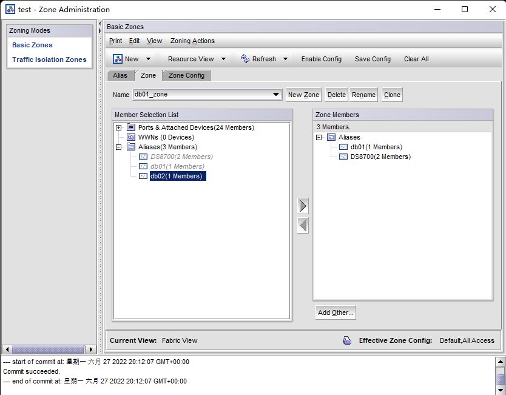
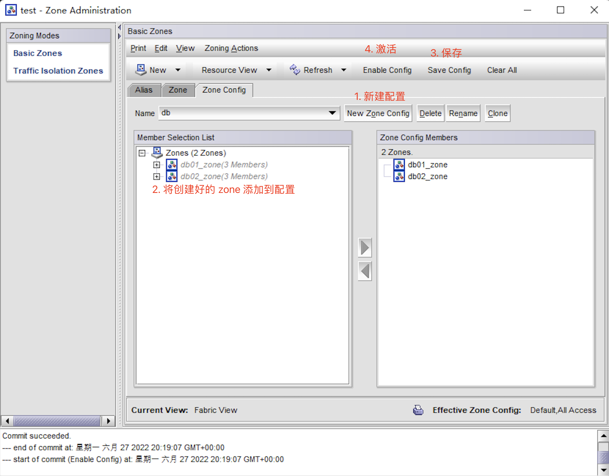

# FC SAN

## FC 拓扑结构



​		FC主要有三种拓扑结构，用以描述各个节点的连接方式。光纤通道术语中的“节点” 是指通过网络进行通信的任何实体，而不一定是一个硬件节点。这个节点通常是一个设备， 比如说一个磁盘存储器，服务器上的一个主机总线适配器或者是一个光纤网交换机。

- 点到点式
  - 两个设备背对背直接连接。这是最简单的一种拓扑，连接能力受限。 
- 仲裁环式 
  - 这种设计方式中，所有设备连接在一个类似于令牌环的环路上。这个环路中添加或者移 除一个设备会导致环路上所有活动中断。一个设备的故障导致整个环路不能进行工作。光纤通道集线器能够用于将众多设备连接到一起形成一个逻辑上的环路，并且能够旁路故障 节点，使得环上节点的故障不会影响整个环路的通信。一个环路也可以通过使用线缆直接 将节点一个接一个的连接成一个环而实现。最小的环路只包含两个节点，这种结构看起来 和点到点式连接近似，它们的区别在很大程度上取决于各自的协议。
- 光纤交换式
	- 所有的设备或者设备环都被连接到光纤网交换机上，与现有的以太网的实现形式在概念 上是类似的。这种拓扑结构相对于点到点和仲裁环的优势在于：
		- 交换机对结构形式进行管理，提供了最好的互联形式。
		- 多对节点可以同时通信。
		- 各个节点的故障是孤立的，不会危及其他节点的工作。

## FC 交换机端口



光纤网交换机中具有一些称为端口（Port）的连接部件，不同的端口根据其所连接的设 备类型，所起到的作用是不同的。光纤通道标准定义了以下端口：

- F_Port
  - F端口也被称为光纤网端口，用于将服务器和存储设备连接到交换机上。一个被连接到 交换机F端口的设备就是一个节点（Node），用光纤通道术语来说，它被看作是一个N端 口（N_Port）。如果是在仲裁环路拓扑结构中，则被称为NL端口（NL_Port）。交换机通过特定的N端口或者是NL端口名称来识别这些光纤通道节点

- E_Port
  - E端口也被称为扩展端口，被用于进行交换机之间的连接

- FL_Port
  - FC交换机的一个交换端口可以作为环路的组成部分，数据可以从交换机中传输到环上。 在环路环境下正常工作的一个交换端口称之为 FL_port

- G_Port：通用端口G端口
  - G端口是一种通用的端口，根据具体的实现方案，可以作为F端口或是E端口使用，也就 意味着G端口实际上可以被用作两种端口功能的组合。 由于G端口的自适应性， 在进行 FC-SAN的多交换机配置环境时，G端口为交换机提供了更好的灵活性并降低了每个端口 所耗费的管理成本

## FC HBA 卡 WWN

FC HBA的WWN具有两种类型： 
- WWNN（World Wide Node Name） 

	全球唯一节点名字，由光纤通道进行映射的分配给每一个上层节点一个全球惟一的64 位标识符，一个HBA上的所有端口共享一个WWNN。在计算机处理中，一个WWNN被分 配给一个接入到光纤网中的节点（一个端点， 如，一个设备）。WWNN可以被一个或者 多个不同的端口（每个端口拥有不同的WWPN，并且属于同一个节点）共同使用。

- WWPN（World Wide Port Name） 

	全球惟一端口名字， 分配给每一个光纤通道端口的全球惟一的64 位标示符， 每个 WWPN被该端口独享。WWPN在存储区域网络中的应用就等同于MAC地址在以太网协议 中的应用。
## FC 基本配置

### Brocade 300 光交配置

#### 1. 设备图



#### 2. 配置准备

Brocade 交换机采用 B/S 架构，远程客户端通过交换机以太网管理端口实现对交换机的监控及配置。在配置之前首先要在客户端安装 [Java运行环境 JRE](https://pan.ecarry.cc/software/JRE6.0.zip)

#### 3. 设备配置

修改客户端 ip 地址与交换机为同一子网 10.77.77.**

打开浏览器输入 http://10.77.77.77 ，之后出现登录对话框：

- user: `admin `

- password: `password`

#### 4. 常用配置命令

详细配置见官方文档：[Brocade Switch Cookbook](https://pan.ecarry.cc/%E5%8D%9A%E7%A7%91%E5%85%89%E4%BA%A4%E6%89%8B%E5%86%8C/Brocade-Switch-Cookbook.pdf)

##### 基础命令

```shell
Brocade300:admin> version	# 显示交换机信息
Kernel:     2.6.14.2
Fabric OS:  v7.0.0c
Made on:    Thu Oct 27 00:27:45 2011
Flash:	    Mon Sep 17 04:34:39 2012
BootProm:   1.0.9
Brocade300:admin> ipAddrShow	# 显示交换机 ip

SWITCH
Ethernet IP Address: 192.168.88.103
Ethernet Subnetmask: 255.255.255.0
Gateway IP Address: 192.168.88.1
DHCP: Off

Brocade300:admin> ipaddrset # 配置交换机管理口
Ethernet IP Address [192.168.88.103]:
Ethernet Subnetmask [255.255.255.0]:
Gateway IP Address [192.168.88.1]:
DHCP [Off]:

Brocade300:admin> switchshow # 显示交换机信息
switchName:	Brocade300
switchType:	71.2
switchState:	Online
switchMode:	Native
switchRole:	Principal
switchDomain:	1
switchId:	fffc01
switchWwn:	10:00:00:27:f8:07:d7:3f
zoning:		ON (db)
switchBeacon:	OFF

Index Port Address Media Speed State     Proto
==============================================
   0   0   010000   id     N8   No_Light    FC
   1   1   010100   id     N8   No_Light    FC
   2   2   010200   id     N8   No_Light    FC
   3   3   010300   id     N8   No_Light    FC
   4   4   010400   id     N8   No_Light    FC
   5   5   010500   id     N8   No_Light    FC
   6   6   010600   id     N8   No_Light    FC
   7   7   010700   id     N8   No_Light    FC
   8   8   010800   --     N8   No_Module   FC  (No POD License) Disabled
   9   9   010900   --     N8   No_Module   FC  (No POD License) Disabled
  10  10   010a00   --     N8   No_Module   FC  (No POD License) Disabled
  11  11   010b00   --     N8   No_Module   FC  (No POD License) Disabled
  12  12   010c00   --     N8   No_Module   FC  (No POD License) Disabled
  13  13   010d00   --     N8   No_Module   FC  (No POD License) Disabled
  14  14   010e00   --     N8   No_Module   FC  (No POD License) Disabled
  15  15   010f00   --     N8   No_Module   FC  (No POD License) Disabled
  16  16   011000   --     N8   No_Module   FC  (No POD License) Disabled
  17  17   011100   --     N8   No_Module   FC  (No POD License) Disabled
  18  18   011200   --     N8   No_Module   FC  (No POD License) Disabled
  19  19   011300   --     N8   No_Module   FC  (No POD License) Disabled
  20  20   011400   --     N8   No_Module   FC  (No POD License) Disabled
  21  21   011500   --     N8   No_Module   FC  (No POD License) Disabled
  22  22   011600   --     N8   No_Module   FC  (No POD License) Disabled
  23  23   011700   --     N8   No_Module   FC  (No POD License) Disabled
  
Brocade300:admin> switchstatusshow # 显示交换机运行状态
Switch Health Report                        Report time: 06/27/2022 09:02:40 PM
Switch Name: 	Brocade300
IP address:	192.168.88.103
SwitchState:	HEALTHY
Duration:	4586:12

Power supplies monitor	HEALTHY
Temperatures monitor  	HEALTHY
Fans monitor          	HEALTHY
Flash monitor         	HEALTHY
Marginal ports monitor	HEALTHY
Faulty ports monitor  	HEALTHY
Missing SFPs monitor  	HEALTHY
Error ports monitor  	HEALTHY


All ports are healthy

Brocade300:admin> cfgshow # 显示交换机配置信息
Defined configuration:
 cfg:	db	db01_zone; db02_zone
 zone:	db01_zone
		db01; DS8700
 zone:	db02_zone
		db02; DS8700
 alias:	DS8700	1,1; 1,2
 alias:	db01	1,0
 alias:	db02	1,3

Effective configuration:
 cfg:	db
 zone:	db01_zone
		1,0
		1,1
		1,2
 zone:	db02_zone
		1,3
		1,1
		1,2
		
```

##### 备份配置文件与还原

**Uploading a configuration file in interactive mode**

1. Verify that the FTP or SCP service is running on the host computer. 
2. Connect to the switch and log in as admin. 
3.  Enter the configUpload command. The command becomes interactive and you are prompted for the required information. 
4.  Store a soft copy of the switch configuration information in a safe place for future reference.

```shell
switch:admin> configupload
Protocol (scp, ftp, local) [ftp]:
Server Name or IP Address [host]: 10.1.2.3
User Name [user]: UserFoo
Path/Filename [<home dir>/config.txt]: switchConfig.txt
Section (all|chassis|FID# [all]): chassis
Password: <hidden>
configUpload complete 
```

**Configuration file restoration** 

1. Verify that the FTP service is running on the server where the backup configuration file is located. 
2. Connect to the switch and log in using an account assigned to the admin role, and if necessary with the chassis-role permission.
3. If there are any changed parameters in the configuration file that do not belong to SNMP, Fabric Watch, or ACL, disable the switch by entering the `switchDisable` command. 
4. Enter the `configDownload` command. The command becomes interactive and you are prompted for the required information. 
5. At the “Do you want to continue [y/n]” prompt, enter y. 
6. Wait for the configuration to be restored. 
7. If you disabled the switch, enter the `switchEnable` command when the process is finished. 

```shell
switch:admin> configdownload
Protocol (scp, ftp, local) [ftp]:
Server Name or IP Address [host]: 10.1.2.3 
User Name [user]: UserFoo
Path/Filename [<home dir>/config.txt]:
Section (all|chassis|FID\# [all]): all
*** CAUTION ***
This command is used to download a backed-up configuration
for a specific switch. If using a file from a different
switch, this file's configuration settings will override
any current switch settings. Downloading a configuration
file, which was uploaded from a different type of switch,
may cause this switch to fail. A switch reboot might be
required for some parameter changes to take effect.
configDownload operation may take several minutes
to complete for large files.
Do you want to continue [y/n]: y
Password: <hidden>
configDownload complete. 
```


## FC 交换机 Zone 概念

- Zone 是可进行互通的端口或设备的名称构成的集合
- 在一个 zone 里的设备只能与同一个 zone 中的其他设备通信
- 一个设备可以同时在多个 zone 里



- Basic Zones:（基本分区）
  - 设置基本分区，控制各设备或端口之间的访问权限
- Traffic Isolation Zones：（流量隔离分区）
  - 当存在多条 ISL 级联链路（多个E_Port）时，用于指定某条 ISL 链路只负责传送与该链路 E_Port 在同一Zone内的端口的流量

## FC 交换机 Zone 基本配置（Web）



###  端口绑定

#### 1. 设置 Ailas

将服务器 db1 db2 和存储 ds8700 节点设置别名：




#### 2. 创建 zone




#### 3. 创建配置并保存激活



### WWNs 绑定


## FC 交换机 Zone 基本配置（CLI）

