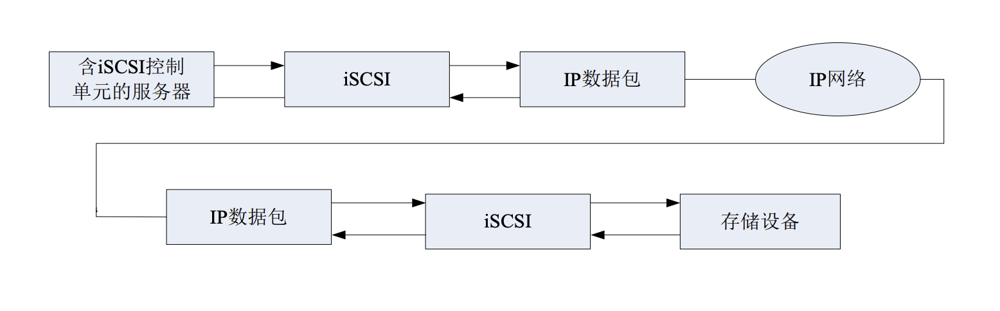
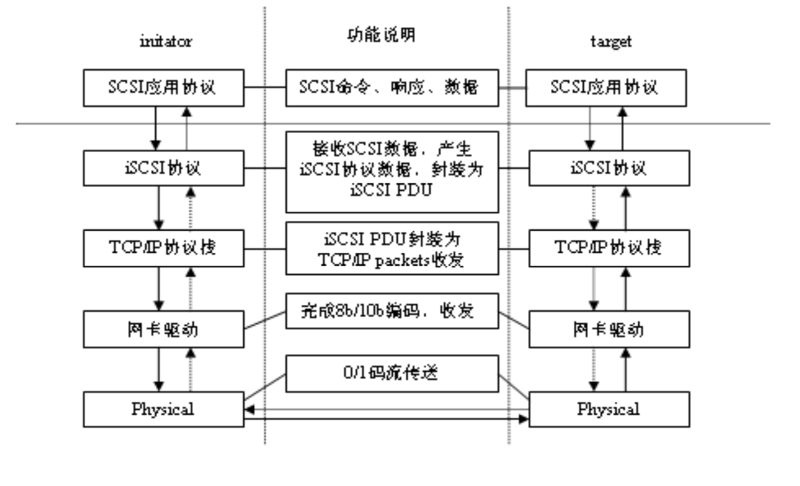
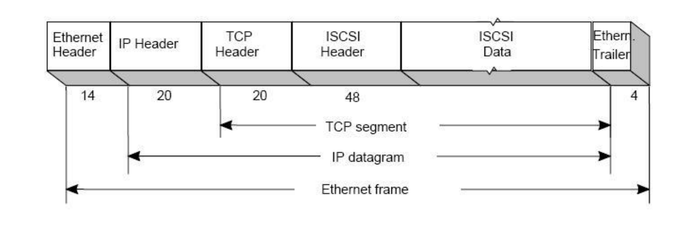
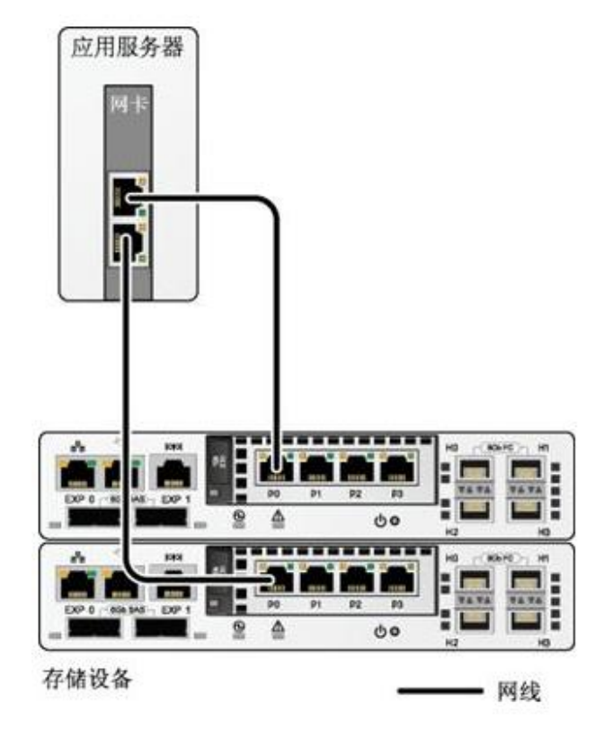
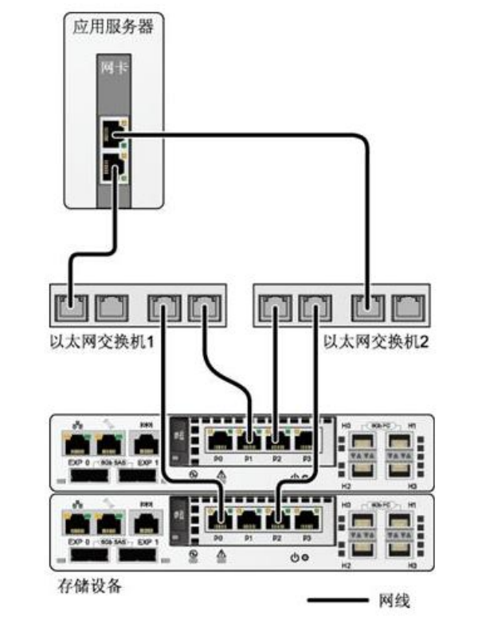

# IP SAN

## ISCSI 基本概念

### 什么是 IP SAN

通过  百兆/千兆/万兆**以太网**络连接应用**服务器**和**后端存储系统**。将SCSI指令和数据块通过高速以太网传输，继承以太网的优点，实现建立一个开放、高性能、高可靠性，高可扩展的存 储资源平台。

优势：

- 实现弹性扩展的存储网络，能自适应应用的改变。
- IP跨长距离扩展能力，轻松实现远程数据复制和灾难恢复。 
- 普及程度高，大量技术人员掌握，减少培训和人力成本。 
- 将以太网的经济性引入存储，降低用户总体拥有成本。

### ISCSI 工作流程

iSCSI 协议就是一个在网络上**封包**和**解包**的过程。在网络的一端，数据包被封装成包括**TCP/IP 头**、**iSCSI 识别包**和 **SCSI 数据**三部分内容，传输 到网络另一端时，这三部分内容分别被顺序地解开。 iSCSI的工作流程如图所示：

### ISCSI 协议分层

### ISCSI 数据包 PDU

- PDU = Protocol Data Unit
- 48Byte 头分节 + 携带的其他数据
- 头分节中的操作码

## 组网与相关配置

### 主机连接存储系统组网图

- 多路径直连组网图

- 多路径交换机组网图

