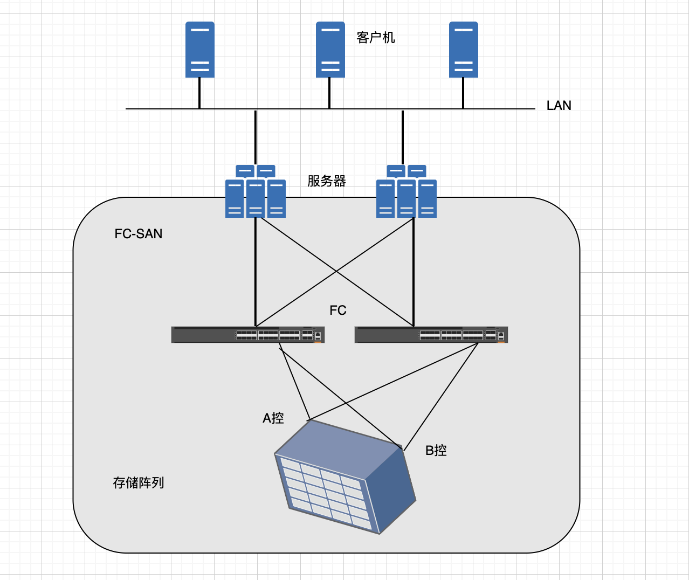
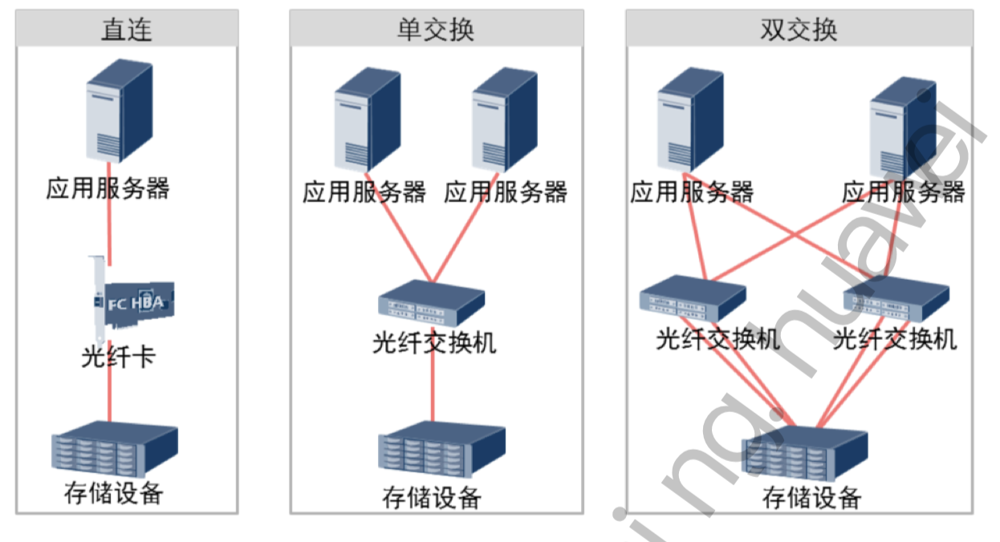
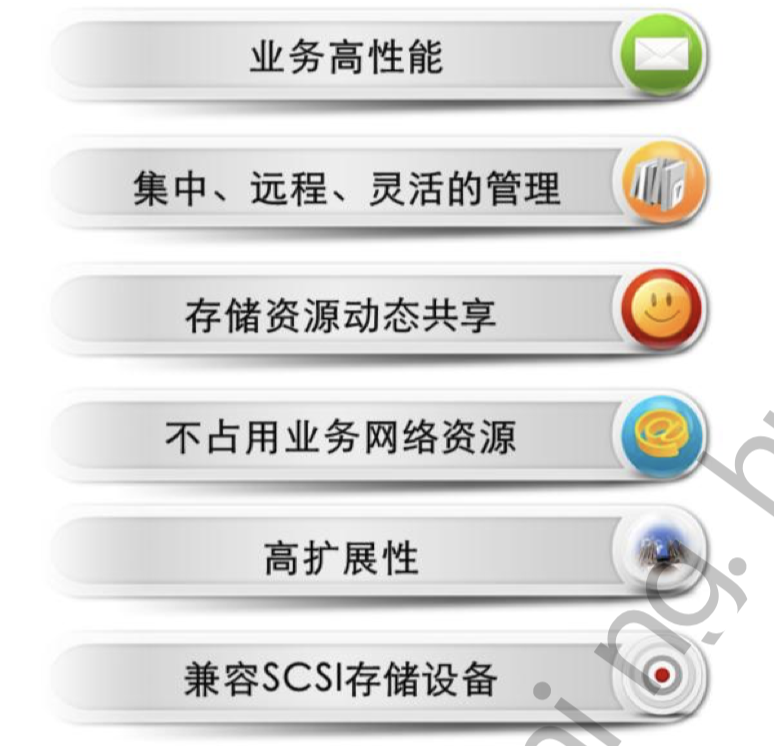

# 什么是 SAN

::: tip SAN

存储区域网络（Storage Area Network）

:::

​		存储区域网络(Storage Area Networks，SAN)：一个存储网络是一个用在服务器和存储资 源之间的、专用的、高性能的网络体系。 SAN是独立于LAN的服务器后端存储专用网络。 SAN采用可扩展的网络拓扑结构连接服务器和存储设备，每个存储设备不隶属于任何一台 服务器，所有的存储设备都可以在全部的网络服务器之间作为对等资源共享。

​		SAN主要利用Fibre Channel protocol（光纤通道协议），通过FC交换机建立起与服务器和存储设备之间的直接连接，因此我们通常也称这种利用FC连接建立起来的SAN为FC-SAN。 FC特别适合这项应用，原因在于一方面它可以传输大块数据，另一方面它能够实现较远距 离传输。SAN主要应用在对于性能、冗余度和数据的可获得性都有很高的要求高端、企业 级存储应用上。

​		随着存储技术的发展，目前基于TCP/IP协议的IP-SAN也得到很广泛的应用。IP-SAN具备 很好的扩展性、灵活的互通性，并能够突破传输距离的限制，具有明显的成本优势和管理 维护容易等特点。针对IP-SAN技术的详细内容将在下一章讲解，接下来重点介绍SAN技术。

## SAN 典型组网

- 直连（DAS）：主机与存储之间通过FC HBA卡连接，这种组网方式简单、经济，但较多的主机 分享存储资源比较困难
- 单交换：主机与存储之间由一台FC交换机连接，这种组网结构使多台主机能共同分享 同一台存储设备，扩展性强，但交换机处存在单点故障
- 双交换：同一台主机到存储阵列端可由多条路径连接，扩展性强，避免了在交换机处形成单点故障

## SAN 存储网络特点

与传统DAS存储相比， SAN存储网络具备非常明显的优势：

1. 基于FC光纤介质，拥有千兆位的存储带宽，更适合大容量数据块业务高速处理的要求， 目前主流带宽为8G。

2. 由于SAN存储网络中存储设备（如磁盘阵列，磁带库等）集中部署，可以实现对设备 的集中管理，同也可以通过远程方式登录设备实现远程管理，管理方式更加灵活。

3. 存储资源集中统一部署，分别映射给各应用服务器，实现存储资源的共享，同时可以 根据各应用服务器对存储资源的需求为其动态的分配资源，实现存储资源的动态共享。

4. 在SAN存储网络，数据的传输、复制、迁移、备份等在SAN网内高速进行， 不需占用业务网络WAN/LAN的带宽资源。

5. 在SAN存储网络环境下，扩展存储资源变得非常容易，只需要增加新的存储设备到SAN 存储网络中即可，实现平滑的扩容。新增的存储资源可以直接映射给应用服务器使用。

6. 由于SAN存储网络使用的FC协议实现了对SCSI协议的封装，因此可以实现对以前的各种 SCSI存储设备的兼容，在异构环境下，更能体现其优势。

## SAN 存储的应用

SAN存储网络主要应用在：

- 对响应时间、可用性和可扩展性要求高的关键任务数据库应用。 
- 对性能、数据完整性和可靠性要求高的集中存储备份，以保证关键数据的安全，可极大 地提高企业数据备份和恢复操作可靠性和可扩展性。 
- 海量存储的应用环境。例如，图书馆、银行、证券、中大型企业或组织的数据中心。 
- 支持服务器及其连接设备之间提供光纤通道高性能和扩展的距离。

## SAN 与 DAS 区别

|      |                    DAS                     |                             SAN                              |
| :--- | :----------------------------------------: | :----------------------------------------------------------: |
| 协议 |                    SCSI                    |                              FC                              |
| 应用 | 对存储容量不高、服务器数量少的中小型局域网 | 关键数据库、集中存储、海量存储、备份、容灾等中高端存储应用环境 |
| 优势 |              部署简单、投资少              |          高可用、高性能、高扩展性、兼容性、集中管理          |
| 劣势 |   可扩展差、资源浪费、不易管理、性能瓶颈   |                            投资高                            |

